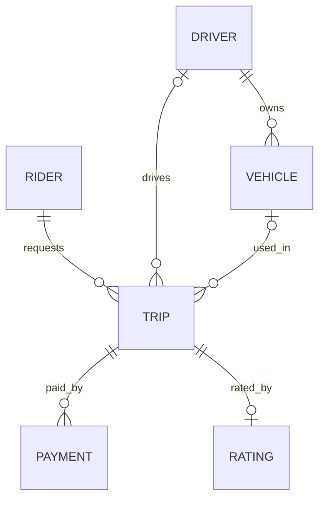
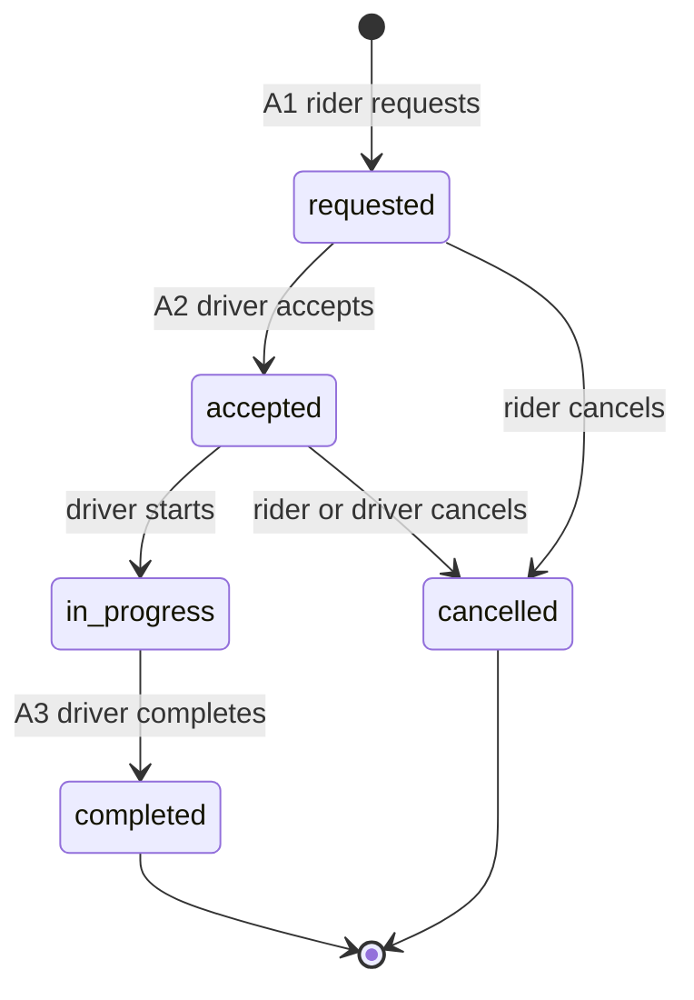

# Ride-hailing design

This is a design document and a proven PostgreSQL schema for a ride-hailing service in one city. It describes the product rules, data model, API contract, performance decisions, and evidence that the database enforces the important states. The document is the deliverable.

## Reading order

| Read | What it covers |
|---|---|
| [docs/01-requirements.md](docs/01-requirements.md) | Product scope, users, actions, business rules, and assumptions |
| [docs/02-entities.md](docs/02-entities.md) | Entities, fields, relationships, and deliberate snapshots |
| [docs/03-hard-questions](docs/03-hard-questions) | Normalisation, money, state, time, identifiers, constraints, and indexes |
| [docs/04-api-contract.md](docs/04-api-contract.md) | REST conventions, actions, errors, pagination, and authentication assumptions |
| [docs/05-api-analyses](docs/05-api-analyses) | REST versus GraphQL and SSE versus WebSockets decisions |
| [sql/](sql/) | PostgreSQL schema, seed data, queries, plans, and invalid-state demonstrations |

## The model at a glance





## The seven hard questions

[Normalisation](docs/03-hard-questions#1-normalisation-where-does-each-fact-live) gives each fact one home and deliberately snapshots the driver name, vehicle plate, fare, and payment amount where historical accuracy requires it.

[Money](docs/03-hard-questions#2-money) uses whole-number kobo values in `bigint`, stores currency beside every amount, and avoids decimal or floating-point drift.

[Status and state](docs/03-hard-questions#3-status-and-state) defines the allowed trip and payment transitions and combines enums, transition tables, triggers, and shape checks to prevent invalid lifecycle states.

[Time](docs/03-hard-questions#4-time) uses UTC `timestamptz`, automatic `updated_at` maintenance, soft deletion for people and vehicles, and retention of trips, payments, and ratings.

[Identifiers](docs/03-hard-questions#5-identifiers) uses database-generated UUIDs to reduce predictable resource identifiers while still requiring ownership checks at the API boundary.

[Constraints](docs/03-hard-questions#6-constraints) makes duplicate active trips, mismatched vehicles or fares, duplicate successful payments, premature ratings, and other invalid states impossible at the database layer.

[Indexes](docs/03-hard-questions#7-indexes) maps the main actions and history reads to partial, composite, and lookup indexes, with stable cursor ordering using timestamps and IDs.

## The API

| Action | Method | Path | Caller | How it stays idempotent |
|---|---|---|---|---|
| A1 Request a trip | `POST` | `/api/v1/trips` | Rider | R1 prevents a second active trip; a retry receives the existing trip ID |
| A2 Accept a trip | `POST` | `/api/v1/trips/:id/accept` | Driver | Conditional state update allows one acceptance; repeating an acceptance returns the current trip |
| A3 Start, complete, or cancel | `POST` | `/api/v1/trips/:id/start`, `/complete`, `/cancel` | Assigned driver or trip rider, as defined per command | Repeating an already-applied state command returns the unchanged trip |
| A4 Pay for a trip | `POST` | `/api/v1/trips/:id/payments` | Trip rider | `Idempotency-Key` is unique; provider webhook repeats do not reapply a settled status |
| A5 Rate the driver | `POST` | `/api/v1/trips/:id/rating` | Trip rider | One rating per trip; repeating the same content returns the existing rating |

See the [API analyses](docs/05-api-analyses): REST is the choice for now because the MVP payloads do not justify GraphQL complexity; cursor pagination avoids shifting pages as new trips arrive; SSE provides one-way live location and trip updates to the rider.

## How to run

Use PostgreSQL 18 and set `PGPASSWORD` only in the terminal session. Never write a password in any file. From PowerShell, run these commands in order:

```powershell
& "C:\Program Files\PostgreSQL\18\bin\psql.exe" -U postgres -p 5433 -d ride_hailing -f sql/000_reset.sql
& "C:\Program Files\PostgreSQL\18\bin\psql.exe" -U postgres -p 5433 -d ride_hailing -f sql/001_schema.sql
& "C:\Program Files\PostgreSQL\18\bin\psql.exe" -U postgres -p 5433 -d ride_hailing -f sql/002_seed_small.sql
& "C:\Program Files\PostgreSQL\18\bin\psql.exe" -U postgres -p 5433 -d ride_hailing -f sql/003_seed_volume.sql
& "C:\Program Files\PostgreSQL\18\bin\psql.exe" -U postgres -p 5433 -d ride_hailing -f sql/004_queries.sql
& "C:\Program Files\PostgreSQL\18\bin\psql.exe" -U postgres -p 5433 -d ride_hailing -f sql/005_explain.sql
& "C:\Program Files\PostgreSQL\18\bin\psql.exe" -U postgres -p 5433 -d ride_hailing -f sql/006_invalid_inserts.sql
```

Script `003` loads about 60,000 trips. Scripts `004` and `006` run inside `BEGIN` and `ROLLBACK`, leaving the data unchanged.

## Evidence

The evidence directory contains exactly these six images:

- [data-unchanged-after-demos.png](docs/evidence/data-unchanged-after-demos.png) — Shows one terminal result after the demos: `trips 60012`, `t1_status in_progress`, and `ratings 33927`. It is a single run, not a before-and-after comparison, so it does not by itself prove that the data was unchanged.
- [invalid-inserts.png](docs/evidence/invalid-inserts.png) — Shows five rejected statements: duplicate active rider trip, non-completed rating, mismatched payment amount, invalid `in_progress` to `cancelled` transition, and wrong-driver vehicle assignment; the visible errors name the rejecting constraints or trigger.
- [query-plan-driver-rating.png](docs/evidence/query-plan-driver-rating.png) — Shows the driver-rating aggregate plan using `trip_driver_history_idx` for `trip` and a sequential scan on `rating`.
- [query-plan-rider-history.png](docs/evidence/query-plan-rider-history.png) — Shows the rider-history plan using an index scan on `trip_rider_history_idx`.
- [schema-trip-columns-indexes.png](docs/evidence/schema-trip-columns-indexes.png) — Shows a cropped terminal fragment with clipped table text and trigger lines; the trip column list and Indexes list are not visible.
- [schema-trip-keys-triggers.png](docs/evidence/schema-trip-keys-triggers.png) — Shows a cropped `Triggers` fragment including `set_updated_at_trip`, `trip_initial_status_trg`, and `trip_status_transition_trg`; Foreign-key constraints and Referenced by are not visible.

The two schema images overlap on the visible trigger output, and neither image visibly supplies all of the requested schema sections.

## What went wrong

The volume seed initially had a column-order mismatch that put a text plate number into a timestamp column. PostgreSQL rejected it with a type error, and the single transaction rolled everything back, so nothing was half loaded.

The queries file completed a fixture trip, which made the invalid-insert demo report the wrong forbidden move: `completed` to `cancelled` instead of `in_progress` to `cancelled`. A leftover insert before `BEGIN` also made test 1 fire against a different rider. Both files now run inside `BEGIN` and `ROLLBACK`.

The driver-rating average plan uses an index on `trip` but a sequential scan on `rating`. For a driver with thousands of trips, one pass over `rating` costs less than thousands of index probes. This is the plan shown in the evidence; it does not establish how a small driver's plan looks.

## Trade-offs and limits

Rating has no `driver_id`, so a driver's average requires a join through trips. Triggers are disabled only during the bulk load. Fares are fixed upfront, authentication is assumed, and locations are stored as plain coordinates. About 60 percent of completed trips have a rating; the exact count changes with each seed.
