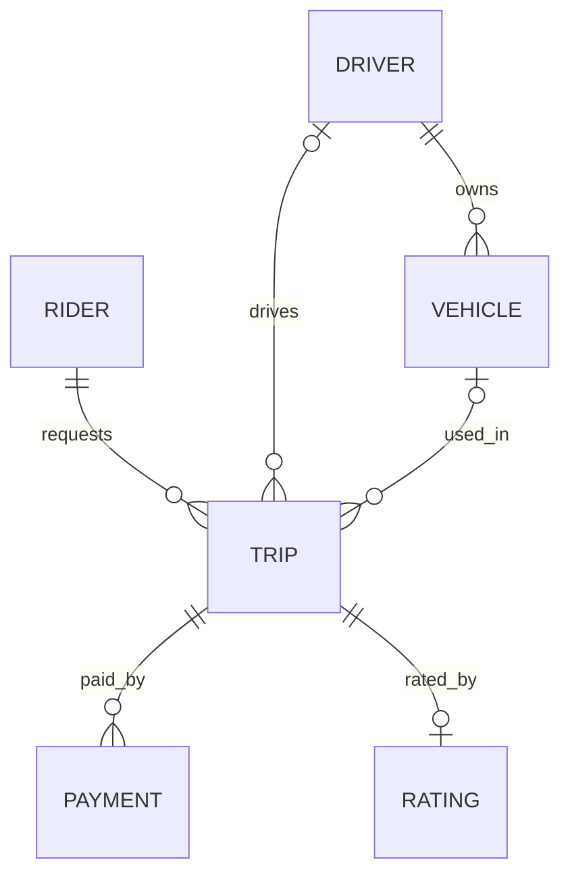

# Ride-hailing: entities and relationships

## Conventions
- **Identifiers:** every table has `id uuid`, generated by the database 
  with `gen_random_uuid()`. Never a sequential integer.
- **Names:** snake_case, so the SQL needs no quoting. `created_at` and 
  `updated_at` are the createdAt and updatedAt of the brief.
- **Time:** `timestamptz`, stored in UTC. Every table has `created_at` 
  and `updated_at`.
- **Money:** `bigint` in kobo, with a `currency char(3)` on the same row.

## rider
A person who requests and pays for trips.

| Field | Type | Required | Notes |
|---|---|---|---|
| id | uuid | yes | primary key |
| full_name | text | yes | |
| phone | text | yes | unique |
| email | text | yes | unique |
| created_at | timestamptz | yes | |
| updated_at | timestamptz | yes | |
| deleted_at | timestamptz | no | set when the account is closed |

## driver
A person who accepts and completes trips.

| Field | Type | Required | Notes |
|---|---|---|---|
| id | uuid | yes | primary key |
| full_name | text | yes | |
| phone | text | yes | unique |
| email | text | yes | unique |
| licence_number | text | yes | unique |
| created_at | timestamptz | yes | |
| updated_at | timestamptz | yes | |
| deleted_at | timestamptz | no | set when the account is closed |

## vehicle
A car registered to one driver.

| Field | Type | Required | Notes |
|---|---|---|---|
| id | uuid | yes | primary key |
| driver_id | uuid | yes | foreign key to driver |
| plate_number | text | yes | unique |
| make | text | yes | |
| model | text | yes | |
| colour | text | yes | |
| year | smallint | yes | |
| created_at | timestamptz | yes | |
| updated_at | timestamptz | yes | |
| deleted_at | timestamptz | no | set when the vehicle is retired |

## trip
One journey from pickup to destination. It is the centre of the model.

| Field | Type | Required | Notes |
|---|---|---|---|
| id | uuid | yes | primary key |
| rider_id | uuid | yes | foreign key to rider |
| driver_id | uuid | no | foreign key to driver, empty until accepted |
| vehicle_id | uuid | no | foreign key to vehicle, empty until accepted |
| status | trip_status | yes | requested, accepted, in_progress, completed, cancelled. Default requested |
| pickup_lat, pickup_lng | numeric(9,6) | yes | |
| dropoff_lat, dropoff_lng | numeric(9,6) | yes | |
| estimated_fare_minor | bigint | yes | shown to the rider at request |
| fare_minor | bigint | no | set when the trip completes (R4) |
| currency | char(3) | yes | one currency for both amounts on the row |
| driver_name_snapshot | text | no | copied from driver when accepted |
| vehicle_plate_snapshot | text | no | copied from vehicle when accepted |
| cancelled_by | cancelled_by | no | rider or driver |
| accepted_at, started_at, completed_at, cancelled_at | timestamptz | no | one per state change |
| created_at | timestamptz | yes | this is the request time |
| updated_at | timestamptz | yes | |

Trips are never deleted (R8), so there is no `deleted_at`.

## payment
One attempt to charge a rider for a completed trip.

| Field | Type | Required | Notes |
|---|---|---|---|
| id | uuid | yes | primary key |
| trip_id | uuid | yes | foreign key to trip |
| amount_minor | bigint | yes | |
| currency | char(3) | yes | |
| status | payment_status | yes | pending, succeeded, failed, refunded. Default pending |
| provider | text | yes | the payment provider's name |
| provider_reference | text | no | unique when present |
| idempotency_key | text | yes | unique, so a retried request cannot charge twice |
| created_at | timestamptz | yes | |
| updated_at | timestamptz | yes | |

Payments are never deleted (R8).

## rating
A rider's score for a completed trip.

| Field | Type | Required | Notes |
|---|---|---|---|
| id | uuid | yes | primary key |
| trip_id | uuid | yes | foreign key to trip, unique |
| score | smallint | yes | 1 to 5 |
| comment | text | no | |
| created_at | timestamptz | yes | |
| updated_at | timestamptz | yes | |

## Relationships
| Relationship | Cardinality | Meaning |
|---|---|---|
| rider to trip | one to many | a rider has many trips, a trip has exactly one rider |
| driver to trip | one to many | a driver has many trips, a trip has zero or one driver |
| driver to vehicle | one to many | a driver owns many vehicles over time, a vehicle has one driver (R3) |
| vehicle to trip | one to many | a vehicle serves many trips, a trip has zero or one vehicle |
| trip to payment | one to many | a trip can have several attempts, at most one succeeds (R7) |
| trip to rating | one to zero-or-one | a trip has at most one rating (R6) |

## Notes
- **No many-to-many here.** Rule R3 gives each vehicle one driver. If 
  drivers could share a vehicle, it would need a join table with its 
  own unique constraint.
- **Live driver location is streamed, not stored.** The rider watching 
  the driver approach needs no table. This keeps a write-heavy table 
  out of the model.
- **Rating has no driver_id.** The driver is reachable through the 
  trip, so the fact lives in one place.